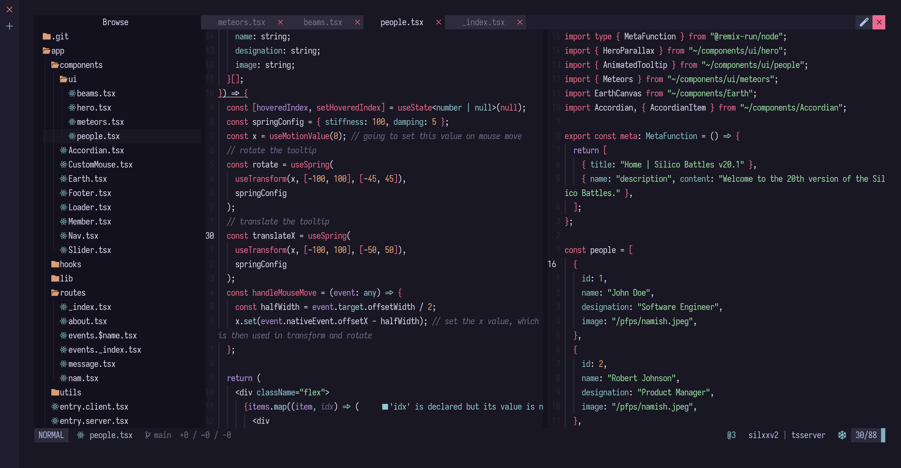

```txt
  Startuptime: 17.58ms
  List of plugins can be found in a readme in lua/plugs folder.

  Based on the actual CPU time of the Neovim process till UIEnter.
  This is more accurate than `nvim --startuptime`.
    LazyStart 7.11ms
    LazyDone  12.27ms (+5.16ms)
    UIEnter   17.58ms (+5.31ms)
```

## Special Thanks 
This config wouldn't have been possible without these chads!
+ [dharmx](https://github.com/dharmx/nvim/)
+ [siduck](https://github.com/NvChad/NvChad)

